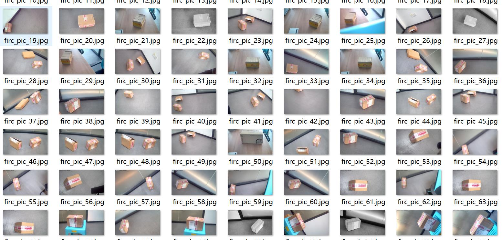
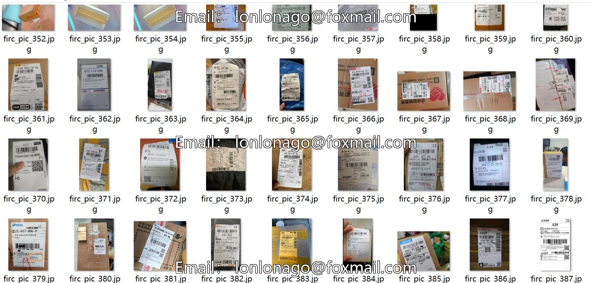
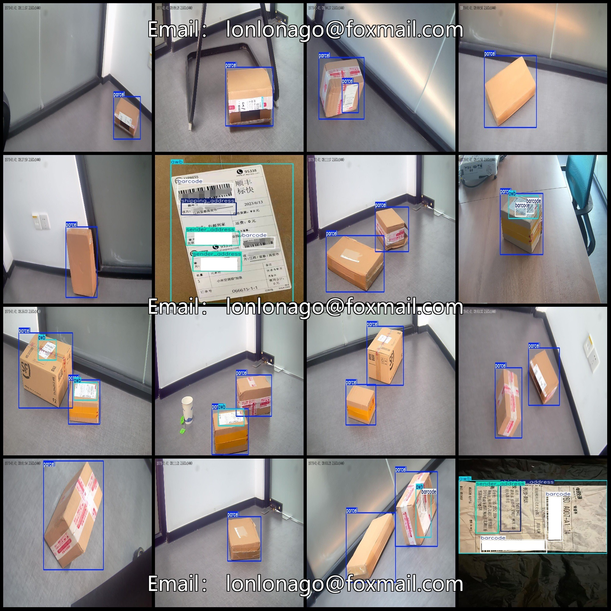
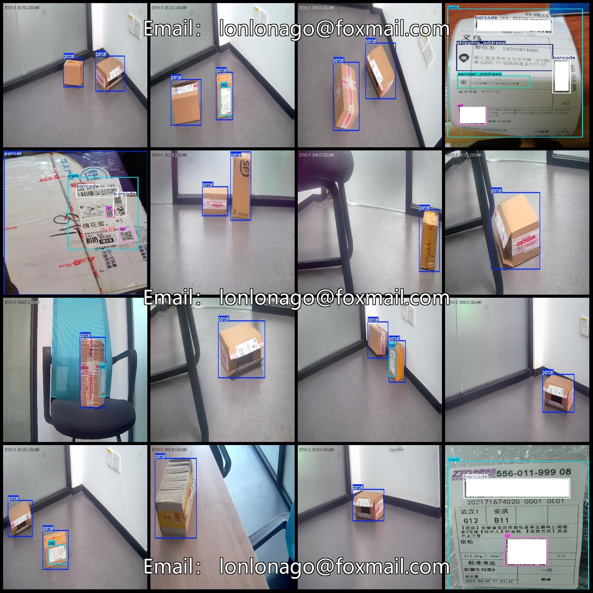

# Chinese Packets Recognition and Detection Dataset (VOC+YOLO) Format: 422 Images, 6 Categories

Dataset format: Pascal VOC format + YOLO format (txt files without split paths, only containing jpg images and corresponding VOC format xml files and yolo format txt files)

Number of image files (jpg file count): 422
Number of annotation files (xml file count): 422
Number of annotation files (txt file count): 422
Number of annotation categories: 6
Annotation category names (note that the order of categories in yolo format is not consistent with this, but refer to the labels folder's classes.txt for reference): ["awb", "barcode", "parcel", "qr",
 "sender_address", "shipping_address"]

Number of bounding boxes per category:
- awb (bill of lading) = 174
- barcode (barcode) = 182
- parcel (package) = 481
- qr (QR code) = 37
- sender_address (sender address) = 55
- shipping_address (shipping address) = 66
Total bounding boxes: 995

Number of images per category:
- awb (bill of lading) = 165
- barcode (barcode) = 100
- parcel (package) = 371
- qr (QR code) = 30
- sender_address (sender address) = 47
- shipping_address (shipping address) = 58

Image resolution: 1280x720

Annotation tool used: labelImg
Annotation rules: draw bounding boxes for each category

Important note: The dataset does not include any partitioning into training, validation, or test sets; it must be manually divided.

Special declaration: This dataset does not guarantee the accuracy of the trained models or weight files.

Image previews:
## Images

Here is a pay link on Stripe ( https://buy.stripe.com/3cs8yP7sY87d0vu9AB ). Please contact me lonlonago@foxmail.com after funding $89, and I will send you a complete data files , thank you!

